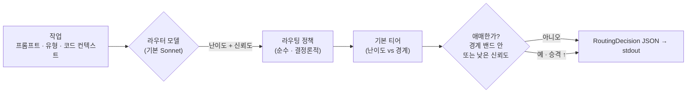

<div align="center">

# 🎯 modelpicker

### 작업마다 알맞은 모델로 — *Fable 토큰 한 톨 쓰기 전에.*

저렴한 **라우터** 모델이 작업이 얼마나 어려운지 판단하고, 결정론적 정책이 *실제로 일할* 모델을
고릅니다. 오버킬 작업이 제일 비싼 티어에 떨어지는 일이 사라집니다.


[English](README.md) · **한국어**

</div>

---

> [!CAUTION]
> **2026-06-15 아카이브됨 — 더 이상 유지보수하지 않습니다.** 이 프로젝트는 *자기 자신의 통합 훅*에
> 의해 죽었어요. 그 아이러니는 아래에 기록합니다. 라이브러리/CLI는 수동 도구로는 여전히 동작하지만,
> 그걸 실제 워크플로우에 붙인 "상시 작동" 훅이 우리를 태웠습니다.

## ☠️ 포스트모템 — 토큰 *절약기*가 어쩌다 토큰 *소각기*가 됐나

**전제.** modelpicker는 비용을 *줄이려고* 만든 도구입니다. 저렴한 라우터가 작업을 판단하고, 그걸 할 수
있는 가장 작은 모델로 돌린다 — Fable 토큰을 쓰기 *전에* 라우팅한다.

**핵심 사인(死因) — 재귀 훅 (토큰 fork-bomb).** 실제 Claude Code 워크플로우에 붙이려고
`UserPromptSubmit` 훅(`hooks/escalation_nudge.py`)을 달아 모든 의미 있는 프롬프트마다 `modelpicker
route`를 호출했습니다. `route`는 `claude -p`로 판단(judge)을 부르는데(기본 `judge_backend:
claude_cli`) — **그 서브프로세스가 프로젝트의 `.claude/settings.local.json`을, 즉 똑같은 그 훅을 다시
로드합니다.** 빠른 시작용 플래그는 MCP와 툴만 껐을 뿐 `--bare`를 안 줘서 자식 프로세스에서도 훅이
살아 있었어요. 그래서 judge의 프롬프트 제출이 훅을 *또* 발동 → `route` → 또 `claude -p` → 또 훅 → …

프롬프트 하나가 추가 호출 *한 번*(당신이 예상한 ≤2배)으로 끝나지 않았습니다. **콜드부트 Claude
세션이 재귀로 체인처럼 쌓였고**, 훅 30초 / judge 25초 타임아웃과 ~3.4초 부팅 지연에만 묶여 — 대략
**8~9단계 깊이**까지 내려간 뒤 타임아웃이 체인을 끊었습니다. 그래서 두 배로 끝난 게 아니라 *폭증*했고,
훅을 떼는 순간 멈춘 거예요. 비용을 *줄이려던* 도구가 비용을 곱으로 불리는 fork-bomb이 됐습니다.

**왜 곱으로 불었나:**
- **재귀가 근본 원인이다.** judge 서브프로세스가 프로젝트 훅을 그대로 물려받음(`--bare` 없음, 재진입
  가드 없음) → judge 호출 하나가 또 다른 judge를 낳음. 진짜 픽스 둘: 띄우는 `claude -p`에 `--bare`를
  주거나, 훅이 검사해서 즉시 종료할 환경변수 센티넬을 심어 **훅이 자기 자신을 못 부르게** 하는 것.
- **서브프로세스엔 프롬프트 캐시가 없다.** 메인 세션은 큰 컨텍스트를 ~1/10 값(캐시)에 읽지만, 매
  `claude -p`는 콜드부트라 시스템 프롬프트를 풀값으로 매번 새로 냅니다. 그래서 체인의 각 마디가
  "가볍지" 않았어요 — 재귀 × 콜드캐시로 곱해진 셈.
- **프리필터가 못 막았다.** `TRIVIAL_SKIP`은 인사·오타수정만 걸러냈고, judge 자신의 분류기 프롬프트는
  그냥 통과 → 재귀 단계마다 다시 장전됐습니다.
- **모든 곳에서 조용히 돌았다.** 프로젝트 범위 훅 → 모든 세션이 비용을 냈고, 어디에 귀속할지도 없이
  누적됐어요 — *"다른 세션에서도 이상해지는데."*
- **절약 계산이 엉뚱한 걸 쟀다.** "~46% 절약"은 라우팅 *결정*만 셌지 *결정하는 비용*은 — 하물며
  재귀로 쌓인 결정 스택은 — 한 번도 안 셌습니다.

**조치 / 최종 상태.** `.claude/settings.local.json`에서 훅 제거 → 체인이 더는 시작될 수 없음. repo
아카이브. 남길 교훈: **(1) `claude`를 띄우는 훅은 `--bare`로 돌리거나 재진입을 막아야 한다 — 안 그러면
자기 자신을 부른다. (2) 자동으로 돌리는 라우터는 그것이 아끼는 결정보다 싸야 한다 — 매 프롬프트마다
모델 호출로 판단하는 건 결코 싸지 않다.**

---

## 아이디어

Fable은 벤치마크는 강하지만 토큰을 많이 먹습니다 — 그리고 작은 모델로도 충분한 일에까지 사람들이
Fable을 꺼내 쓰죠. **modelpicker**는 그 앞에 저렴한 분류(triage) 단계를 둡니다. 라우터 모델(기본
**Sonnet**)이 작업을 읽고 난이도를 가늠하면, 투명한 정책이 어느 티어가 처리할지를 정합니다.

> **두 단계.** **`route`** 는 *어떤* 모델을 *왜* 골랐는지 담은 검증된 **`RoutingDecision` JSON**을
> 내놓고, **`run`** 은 그 모델로 실제 작업을 돌립니다 — 그리고 모델이 닫혀 있으면 **부드럽게 강등**해요
> (Fable 닫힘 → Opus로 폴백 → 그래도 완주). 그래서 지금 라우팅과 실행을 다 하고, Fable이 돌아오면
> 코드 변경 없이 바로 Fable 실행이 켜집니다.

---

## 두 가지 모드

```
 모드 A   opus ── fable                    # $200 / Max 요금제 — Sonnet 불필요
 모드 B   sonnet ── opus ── fable          # 쉬운 작업에서 비용까지 짜내기
          └ 낮음 ───────── 높음 ┘  (역량 & 비용)
```

호출마다 `--mode A|B`로 모드를 고릅니다.

---

## 실제로 아껴지나?

이 프로젝트를 **직접 만든 빌드 세션** — 실제 12개 작업 — 을 라우터에 통과시키면:

| → Sonnet (저렴) | → Opus (중간) | → Fable (최상) |
|:---:|:---:|:---:|
| **5** | **4** | **3** |

12개를 전부 Fable로 돌리는 것 대비 **~46% 비용 절약** — 그것도 작업의 1/3이 진짜 Fable급인데도요.
Fable은 thinking이 항상 켜져 쉬운 작업에도 토큰을 더 태우므로, 실제 절약은 더 큽니다.
재현: [`examples/savings_demo.py`](examples/savings_demo.py).

---

## 어떻게 라우팅하나



1. 라우터 모델이 **`difficulty_score`** 와 **`confidence`**(둘 다 0–1)를 돌려줍니다.
2. `difficulty_score`가 모드별 경계를 통해 **기본 티어**로 매핑됩니다
   (모드 A 기본 `0.5`; 모드 B 기본 `0.4` / `0.75`).
3. **성능 우선 승격** — 점수가 경계 주변 밴드 안에 들거나, `confidence`가 `confidence_threshold`
   아래면 선택을 `escalation_step` 티어(기본 1)만큼 위로 올리고 `escalated`를 `true`로 둡니다.

모든 값 — `confidence_threshold`, 경계, 밴드, `escalation_step`, 모델별 단가 — 은
**config로 조절 가능하며 하드코딩되지 않습니다.**

> **판단은 기본적으로 당신의 Claude 구독요금제로 돌아갑니다.** `judge_backend: claude_cli`(기본값)는
> 로컬 `claude` CLI를 호출해요 — API 키도, 별도 API 과금도 없습니다.
> 대신 Anthropic SDK를 쓰려면 `judge_backend: api` + `ANTHROPIC_API_KEY`로 바꾸면 됩니다.

---

## 빠른 시작

```bash
modelpicker route --mode B \
  --prompt "auth 모듈을 두 파일에 걸쳐 리팩터" \
  --task-type refactor \
  --context-file ./ctx.json \
  --config ./config.yaml \
  --report-json ./metrics.json
```

**stdout에는 결정(JSON)만 나옵니다** (메트릭은 `--report-json`으로):

```json
{
  "selected_model": "opus",
  "reasoning": "두 파일짜리 보통 리팩터; opus면 충분.",
  "difficulty_score": 0.55,
  "confidence": 0.82,
  "estimated_tokens": 510.25,
  "estimated_cost": 0.012756,
  "escalated": false,
  "alternatives": [
    { "model": "sonnet", "score": 0.65 },
    { "model": "fable",  "score": 0.675 }
  ],
  "latency": 0.41
}
```

낮은 신뢰도의 작업은 자동으로 승격됩니다 — `sonnet → opus`, `"escalated": true`.

---

## 실행하기 (v2)

`route`는 *결정만* 합니다. `run`은 결정하고 **그 모델로 작업까지 실행**해요 — 모델이 닫혀 있으면
부드럽게 폴백하면서:

```bash
# 지금 Fable 닫힘 → route는 fable을 고르지만, 실행기가 opus로 강등해 끝까지 완주
modelpicker run --mode B --prompt "분산 레이트리미터 설계" --unavailable fable
```

```
[modelpicker] routed→fable, ran→opus (fell back: fable marked unavailable), 19.8s
<모델의 실제 답변이 stdout으로>
```

stdout엔 모델의 답변이, 한 줄짜리 `[modelpicker]` 메타는 stderr로 나갑니다. `--json`을 주면
`{decision, execution}` 구조로 받을 수 있어요. 폴백은 모드의 티어 순서를 따라 내려갑니다
(`fable → opus → sonnet`). 닫힌 모델은 `--unavailable`(또는 config의 `unavailable_models`)로 표시.
실행도 판단과 같은 백엔드를 씁니다 (`executor_backend: claude_cli` 기본 — 구독, API 키 0).

---

## Claude Code에서 쓰기 (MCP)

modelpicker는 `route`·`run`을 툴로 노출하는 **MCP 서버**를 포함해요. 그래서 MCP 클라이언트
(Claude Code 등)가 CLI를 직접 치는 대신 **필요할 때 호출**할 수 있습니다. 이 repo의
[`.mcp.json`](.mcp.json)이 Claude Code용으로 등록해 둡니다:

```json
{ "mcpServers": { "modelpicker": { "command": "uv", "args": ["run", "--extra", "mcp", "modelpicker-mcp"] } } }
```

클라이언트를 재시작하면 로드돼요. 단 **채팅을 몰래 자동 라우팅하진 않고**, 클라이언트가
`route`/`run` 툴을 명시적으로 부르는 방식입니다.

---

## 설정

| 키 | 기본값 | 의미 |
|-----|---------|---------|
| `judge_backend` | `claude_cli` | `claude_cli` = 구독요금제 로컬 CLI(키 불필요) · `api` = Anthropic SDK |
| `router_model` | `sonnet` | 판단을 내리는 모델 (`haiku` / `sonnet` / `opus`) |
| `confidence_threshold` | `0.6` | 이 아래면 → 승격 |
| `mode_a_difficulty_boundary` | `0.5` | 아래는 opus, 이상은 fable |
| `mode_b_difficulty_boundaries` | `[0.4, 0.75]` | sonnet \| opus \| fable 구분점 |
| `difficulty_boundary_band` | `0.1` | 경계 주변 "애매" 밴드의 절반 폭 |
| `escalation_step` | `1` | 승격 시 올릴 티어 수 |
| `per_model_price_rates` | `{sonnet:15, opus:25, fable:50}` | `estimated_cost`용 $/1M 토큰 |
| `executor_backend` | `claude_cli` | `run`이 작업을 실행하는 방식 (`judge_backend`와 동일 옵션) |
| `executor_fallback` | `true` | 모델이 닫혀 있으면 티어 순서대로 강등 |
| `unavailable_models` | `[]` | 지금 건너뛸 모델, 예: Fable 닫혔으면 `["fable"]` |

[`examples/config.example.yaml`](examples/config.example.yaml) 참고.

---

## 개발

```bash
uv venv && uv pip install -e ".[dev]"
pytest                # 62개 테스트 — 모델을 mock하므로 API 키 불필요
```

테스트 스위트는 라이브 모델을 절대 호출하지 않습니다: 골든 케이스가 고정 판단값
(`tests/fixtures/golden_cases.yaml`)을 결정론적 `route()`에 주입해요. 라이브 `modelpicker route`
호출은 기본적으로 로컬 `claude` CLI로 판단하므로 — **당신 구독으로 돌고 API 키가 필요 없습니다.**
(Anthropic SDK를 쓰려면 `judge_backend: api`로 바꾸세요.)

---

## 구조

```
src/modelpicker/
├─ models.py    pydantic: RoutingRequest · RoutingDecision · GoldenCase · MetricsReport · enums
├─ config.py    RouterConfig — 기본값 · 범위 · JSON/YAML 로딩
├─ router.py    핵심 정책: 난이도 → 티어, 밴드 / 신뢰도 승격  (순수 · 테스트 가능)
├─ llm.py       mock 가능한 판단 — 로컬 `claude` CLI(구독) 또는 Anthropic SDK
├─ executor.py  v2 — 고른 모델로 작업 실행, 부드러운 폴백
├─ report.py    MetricsReport 빌더
└─ cli.py       `modelpicker route …` (결정) · `modelpicker run …` (결정 + 실행)
tests/
└─ fixtures/golden_cases.yaml   결정론적 케이스 10개, 모드별 기대값
```
