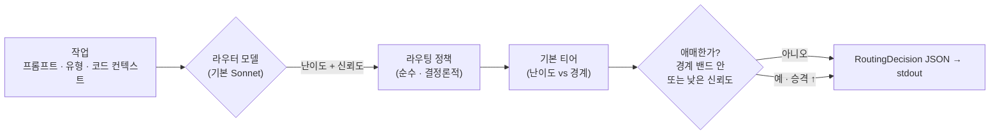

<div align="center">

# 🎯 modelpicker

### 작업마다 알맞은 모델로 — *Fable 토큰 한 톨 쓰기 전에.*

저렴한 **라우터** 모델이 작업이 얼마나 어려운지 판단하고, 결정론적 정책이 *실제로 일할* 모델을
고릅니다. 오버킬 작업이 제일 비싼 티어에 떨어지는 일이 사라집니다.


[English](README.md) · **한국어**

</div>

---

> [!CAUTION]
> **2026년 6월 15일 아카이브 — 더 이상 손대지 않습니다.** 토큰을 아끼자고 만든 도구가, 정작 그걸
> 실제 작업에 붙이는 과정에서 토큰을 왕창 태워버렸습니다. 어쩌다 그렇게 됐는지는 아래에 정리해
> 뒀어요. 라이브러리랑 CLI 자체는 멀쩡하고, 문제는 이걸 "항상 켜져서 돌아가는 훅" 형태로 붙인 데
> 있었습니다.

## ☠️ 포스트모템 — 토큰 절약기가 어쩌다 토큰 소각기가 됐나

modelpicker는 원래 돈을 아끼려고 만든 도구입니다. 작업이 들어오면 저렴한 라우터가 "이거 얼마나
어렵냐"를 먼저 판단하고, 그 작업을 처리할 수 있는 가장 싼 모델로 보냅니다. 비싼 Fable 토큰을 쓰기
전에 한 번 거르자는 거죠. 아이디어 자체는 멀쩡했어요. 정작 터진 건, 이걸 실제 Claude Code 작업
흐름에 어떻게 끼워 넣느냐에서였습니다.

### 무슨 일이 있었나 — 훅이 자기 자신을 부르는 재귀

실제로 써먹으려고, 프롬프트를 보낼 때마다 자동으로 도는 훅을 하나 달았습니다
(`hooks/escalation_nudge.py`, `UserPromptSubmit` 훅). 프롬프트가 들어올 때마다 `modelpicker route`를
불러서 "이번 작업엔 이 모델이 좋겠다"고 슬쩍 알려주는 역할이었죠.

여기에 함정이 있었습니다. `route`는 판단을 내릴 때 `claude -p`로 별도의 Claude를 하나 새로 띄웁니다
(기본 설정이 `judge_backend: claude_cli`). 그런데 그렇게 띄운 Claude도 똑같은 프로젝트 폴더에서
시작하니까, `.claude/settings.local.json`에 적힌 그 훅을 **다시** 읽어 버립니다. 빠르게 띄우려고 넣어
둔 옵션들이 MCP와 툴만 껐을 뿐, 훅을 꺼 주는 `--bare`가 빠져 있었거든요.

그래서 이런 고리가 생겼습니다. 내가 프롬프트를 보낸다 → 훅이 돈다 → `claude -p`가 뜬다 → 그 Claude가
또 훅을 읽고 돈다 → 또 `claude -p`가 뜬다 → … 끝없이 자기가 자기를 부르는 거예요.

### 왜 "기껏해야 두 배"가 아니었나

직관적으로는 "프롬프트 하나에 판단 호출 하나 더 붙는 거니까, 많아야 두 배 아냐?" 싶죠. 재귀만
아니었으면 맞는 말입니다. 그런데 자기가 자기를 부르니까, 프롬프트 하나가 Claude 세션을 줄줄이 쌓아
올렸어요. 무한정은 아니었습니다. 훅 타임아웃 30초, 판단 타임아웃 25초, 한 단계 띄우는 데 3.4초쯤
걸리는 걸 감안하면 대략 8~9단계까지 파고들다가 위에서 타임아웃이 끊었어요. 그러니까 두 배가 아니라 한
방에 확 타올랐다가, 훅을 떼자마자 뚝 멈춘 겁니다.

여기에 캐시 문제까지 겹쳤습니다. 지금 쓰는 메인 세션은 큰 컨텍스트를 캐시로 1/10 값에 읽지만, 새로
띄우는 `claude -p`는 매번 맨바닥에서 시작하니 시스템 프롬프트를 전부 제값 주고 다시 냅니다. 즉 줄줄이
쌓인 세션 하나하나가 다 "무거운" 호출이었던 거죠. 재귀에 콜드 캐시까지 곱해진 셈입니다.

### 어떻게 막았고, 뭘 배웠나

훅을 `.claude/settings.local.json`에서 빼버리니 고리 자체가 시작을 못 합니다. 그리고 repo는
아카이브했어요. 남은 교훈은 둘입니다.

1. **훅에서 `claude`를 띄울 거면 `--bare`로 띄우거나, 재진입을 막아야 한다.** 안 그러면 그 Claude가
   같은 훅을 또 읽고 자기 자신을 부른다. (환경변수 하나 심어 두고, 그게 있으면 훅이 바로 빠지게 하는
   것만으로도 막힌다.)
2. **자동으로 매번 도는 라우터는, 그게 아껴 주는 것보다 싸야 의미가 있다.** 프롬프트마다 모델을
   호출해서 판단하는 건 절대 싸지 않다.

### 그럼 고쳐서 다시 살릴까? — 이 용도엔 아니다

재귀를 고치는 건 사실 한 줄이면 됩니다. 그런데 고쳐도 별로예요. MCP로 `route`를 그때그때 부르는
거나, 그냥 채팅에서 "이거 Sonnet으로 충분할까?" 하고 물어보는 거나 결과가 크게 다르지 않거든요.
오히려 더 비쌀 수도 있습니다. 채팅에서 물어보면 이미 캐시된 컨텍스트를 재활용해서 답 몇 줄 값이면
끝나는데, `route`는 매번 Claude를 맨바닥에서 새로 띄우니까요.

라우터가 진짜 값을 하는 경우는 따로 있습니다. 사람이 채팅에서 직접 고르는 게 아니라, 뭔가 자동화된
게 일관된 기준으로 라우팅을 해야 할 때예요. 그때그때 흔들리지 않는 결정론적 정책이 필요하거나, 실제
작업을 더 싼 모델한테 넘기는 `run`을 쓰거나, 스크립트·CI·배치처럼 사람 없이 호출돼야 하는 경우죠.
혼자 채팅 켜 놓고 자기 쓸 모델 고르는 정도면, 이건 그냥 과한 도구입니다. 그럴 땐 물어보는 게 제일
싸고 빨라요.

그래서 아카이브 상태로 둡니다. 코드랑 테스트 68개는 그대로 남겨놨으니, 언젠가 "사람 말고 시스템이
라우팅해야 하는" 상황이 생기면 그때 다시 꺼내 쓰면 됩니다.

---

## 아이디어

Fable은 벤치마크는 강하지만 토큰을 많이 먹습니다 — 그리고 작은 모델로도 충분한 일에까지 사람들이
Fable을 꺼내 쓰죠. **modelpicker**는 그 앞에 저렴한 분류(triage) 단계를 둡니다. 라우터 모델(기본
**Sonnet**)이 작업을 읽고 난이도를 가늠하면, 투명한 정책이 어느 티어가 처리할지를 정합니다.

> **두 단계.** **`route`** 는 *어떤* 모델을 *왜* 골랐는지 담은 검증된 **`RoutingDecision` JSON**을
> 내놓고, **`run`** 은 그 모델로 실제 작업을 돌립니다 — 그리고 모델이 닫혀 있으면 **부드럽게 강등**해요
> (Fable 닫힘 → Opus로 폴백 → 그래도 완주). 그래서 지금 라우팅과 실행을 다 하고, Fable이 돌아오면
> 코드 변경 없이 바로 Fable 실행이 켜집니다.

---

## 두 가지 모드

```
 모드 A   opus ── fable                    # $200 / Max 요금제 — Sonnet 불필요
 모드 B   sonnet ── opus ── fable          # 쉬운 작업에서 비용까지 짜내기
          └ 낮음 ───────── 높음 ┘  (역량 & 비용)
```

호출마다 `--mode A|B`로 모드를 고릅니다.

---

## 실제로 아껴지나?

이 프로젝트를 **직접 만든 빌드 세션** — 실제 12개 작업 — 을 라우터에 통과시키면:

| → Sonnet (저렴) | → Opus (중간) | → Fable (최상) |
|:---:|:---:|:---:|
| **5** | **4** | **3** |

12개를 전부 Fable로 돌리는 것 대비 **~46% 비용 절약** — 그것도 작업의 1/3이 진짜 Fable급인데도요.
Fable은 thinking이 항상 켜져 쉬운 작업에도 토큰을 더 태우므로, 실제 절약은 더 큽니다.
재현: [`examples/savings_demo.py`](examples/savings_demo.py).

---

## 어떻게 라우팅하나



1. 라우터 모델이 **`difficulty_score`** 와 **`confidence`**(둘 다 0–1)를 돌려줍니다.
2. `difficulty_score`가 모드별 경계를 통해 **기본 티어**로 매핑됩니다
   (모드 A 기본 `0.5`; 모드 B 기본 `0.4` / `0.75`).
3. **성능 우선 승격** — 점수가 경계 주변 밴드 안에 들거나, `confidence`가 `confidence_threshold`
   아래면 선택을 `escalation_step` 티어(기본 1)만큼 위로 올리고 `escalated`를 `true`로 둡니다.

모든 값 — `confidence_threshold`, 경계, 밴드, `escalation_step`, 모델별 단가 — 은
**config로 조절 가능하며 하드코딩되지 않습니다.**

> **판단은 기본적으로 당신의 Claude 구독요금제로 돌아갑니다.** `judge_backend: claude_cli`(기본값)는
> 로컬 `claude` CLI를 호출해요 — API 키도, 별도 API 과금도 없습니다.
> 대신 Anthropic SDK를 쓰려면 `judge_backend: api` + `ANTHROPIC_API_KEY`로 바꾸면 됩니다.

---

## 빠른 시작

```bash
modelpicker route --mode B \
  --prompt "auth 모듈을 두 파일에 걸쳐 리팩터" \
  --task-type refactor \
  --context-file ./ctx.json \
  --config ./config.yaml \
  --report-json ./metrics.json
```

**stdout에는 결정(JSON)만 나옵니다** (메트릭은 `--report-json`으로):

```json
{
  "selected_model": "opus",
  "reasoning": "두 파일짜리 보통 리팩터; opus면 충분.",
  "difficulty_score": 0.55,
  "confidence": 0.82,
  "estimated_tokens": 510.25,
  "estimated_cost": 0.012756,
  "escalated": false,
  "alternatives": [
    { "model": "sonnet", "score": 0.65 },
    { "model": "fable",  "score": 0.675 }
  ],
  "latency": 0.41
}
```

낮은 신뢰도의 작업은 자동으로 승격됩니다 — `sonnet → opus`, `"escalated": true`.

---

## 실행하기 (v2)

`route`는 *결정만* 합니다. `run`은 결정하고 **그 모델로 작업까지 실행**해요 — 모델이 닫혀 있으면
부드럽게 폴백하면서:

```bash
# 지금 Fable 닫힘 → route는 fable을 고르지만, 실행기가 opus로 강등해 끝까지 완주
modelpicker run --mode B --prompt "분산 레이트리미터 설계" --unavailable fable
```

```
[modelpicker] routed→fable, ran→opus (fell back: fable marked unavailable), 19.8s
<모델의 실제 답변이 stdout으로>
```

stdout엔 모델의 답변이, 한 줄짜리 `[modelpicker]` 메타는 stderr로 나갑니다. `--json`을 주면
`{decision, execution}` 구조로 받을 수 있어요. 폴백은 모드의 티어 순서를 따라 내려갑니다
(`fable → opus → sonnet`). 닫힌 모델은 `--unavailable`(또는 config의 `unavailable_models`)로 표시.
실행도 판단과 같은 백엔드를 씁니다 (`executor_backend: claude_cli` 기본 — 구독, API 키 0).

---

## Claude Code에서 쓰기 (MCP)

modelpicker는 `route`·`run`을 툴로 노출하는 **MCP 서버**를 포함해요. 그래서 MCP 클라이언트
(Claude Code 등)가 CLI를 직접 치는 대신 **필요할 때 호출**할 수 있습니다. 이 repo의
[`.mcp.json`](.mcp.json)이 Claude Code용으로 등록해 둡니다:

```json
{ "mcpServers": { "modelpicker": { "command": "uv", "args": ["run", "--extra", "mcp", "modelpicker-mcp"] } } }
```

클라이언트를 재시작하면 로드돼요. 단 **채팅을 몰래 자동 라우팅하진 않고**, 클라이언트가
`route`/`run` 툴을 명시적으로 부르는 방식입니다.

---

## 설정

| 키 | 기본값 | 의미 |
|-----|---------|---------|
| `judge_backend` | `claude_cli` | `claude_cli` = 구독요금제 로컬 CLI(키 불필요) · `api` = Anthropic SDK |
| `router_model` | `sonnet` | 판단을 내리는 모델 (`haiku` / `sonnet` / `opus`) |
| `confidence_threshold` | `0.6` | 이 아래면 → 승격 |
| `mode_a_difficulty_boundary` | `0.5` | 아래는 opus, 이상은 fable |
| `mode_b_difficulty_boundaries` | `[0.4, 0.75]` | sonnet \| opus \| fable 구분점 |
| `difficulty_boundary_band` | `0.1` | 경계 주변 "애매" 밴드의 절반 폭 |
| `escalation_step` | `1` | 승격 시 올릴 티어 수 |
| `per_model_price_rates` | `{sonnet:15, opus:25, fable:50}` | `estimated_cost`용 $/1M 토큰 |
| `executor_backend` | `claude_cli` | `run`이 작업을 실행하는 방식 (`judge_backend`와 동일 옵션) |
| `executor_fallback` | `true` | 모델이 닫혀 있으면 티어 순서대로 강등 |
| `unavailable_models` | `[]` | 지금 건너뛸 모델, 예: Fable 닫혔으면 `["fable"]` |

[`examples/config.example.yaml`](examples/config.example.yaml) 참고.

---

## 개발

```bash
uv venv && uv pip install -e ".[dev]"
pytest                # 62개 테스트 — 모델을 mock하므로 API 키 불필요
```

테스트 스위트는 라이브 모델을 절대 호출하지 않습니다: 골든 케이스가 고정 판단값
(`tests/fixtures/golden_cases.yaml`)을 결정론적 `route()`에 주입해요. 라이브 `modelpicker route`
호출은 기본적으로 로컬 `claude` CLI로 판단하므로 — **당신 구독으로 돌고 API 키가 필요 없습니다.**
(Anthropic SDK를 쓰려면 `judge_backend: api`로 바꾸세요.)

---

## 구조

```
src/modelpicker/
├─ models.py    pydantic: RoutingRequest · RoutingDecision · GoldenCase · MetricsReport · enums
├─ config.py    RouterConfig — 기본값 · 범위 · JSON/YAML 로딩
├─ router.py    핵심 정책: 난이도 → 티어, 밴드 / 신뢰도 승격  (순수 · 테스트 가능)
├─ llm.py       mock 가능한 판단 — 로컬 `claude` CLI(구독) 또는 Anthropic SDK
├─ executor.py  v2 — 고른 모델로 작업 실행, 부드러운 폴백
├─ report.py    MetricsReport 빌더
└─ cli.py       `modelpicker route …` (결정) · `modelpicker run …` (결정 + 실행)
tests/
└─ fixtures/golden_cases.yaml   결정론적 케이스 10개, 모드별 기대값
```
