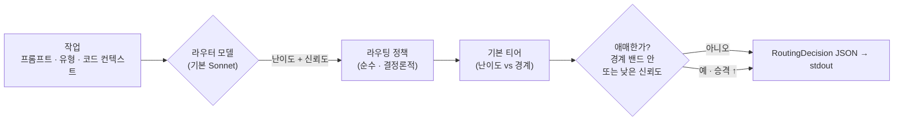

<div align="center">

# 🎯 modelpicker

### 작업마다 알맞은 모델로 — *Fable 토큰 한 톨 쓰기 전에.*

저렴한 **라우터** 모델이 작업이 얼마나 어려운지 판단하고, 결정론적 정책이 *실제로 일할* 모델을
고릅니다. 오버킬 작업이 제일 비싼 티어에 떨어지는 일이 사라집니다.


[English](README.md) · **한국어**

</div>

---

## 아이디어

Fable은 벤치마크는 강하지만 토큰을 많이 먹습니다 — 그리고 작은 모델로도 충분한 일에까지 사람들이
Fable을 꺼내 쓰죠. **modelpicker**는 그 앞에 저렴한 분류(triage) 단계를 둡니다. 라우터 모델(기본
**Sonnet**)이 작업을 읽고 난이도를 가늠하면, 투명한 정책이 어느 티어가 처리할지를 정합니다.

> **v1은 라우터 전용.** *어떤* 모델을 *왜* 골랐는지를 담은 검증된 **`RoutingDecision` JSON**만
> 내놓습니다. 고른 모델로 실제 작업을 돌리는 건 v2 *실행기*(north-star)예요. 이 분리는 의도된 것 —
> Fable을 못 쓰는 지금 라우팅을 미리 준비해두고, 돌아오는 순간 실행만 붙이면 됩니다.

---

## 두 가지 모드

```
 모드 A   opus ── fable                    # $200 / Max 요금제 — Sonnet 불필요
 모드 B   sonnet ── opus ── fable          # 쉬운 작업에서 비용까지 짜내기
          └ 낮음 ───────── 높음 ┘  (역량 & 비용)
```

호출마다 `--mode A|B`로 모드를 고릅니다.

---

## 어떻게 라우팅하나



1. 라우터 모델이 **`difficulty_score`** 와 **`confidence`**(둘 다 0–1)를 돌려줍니다.
2. `difficulty_score`가 모드별 경계를 통해 **기본 티어**로 매핑됩니다
   (모드 A 기본 `0.5`; 모드 B 기본 `0.4` / `0.75`).
3. **성능 우선 승격** — 점수가 경계 주변 밴드 안에 들거나, `confidence`가 `confidence_threshold`
   아래면 선택을 `escalation_step` 티어(기본 1)만큼 위로 올리고 `escalated`를 `true`로 둡니다.

모든 값 — `confidence_threshold`, 경계, 밴드, `escalation_step`, 모델별 단가 — 은
**config로 조절 가능하며 하드코딩되지 않습니다.**

> **판단은 기본적으로 당신의 Claude 구독요금제로 돌아갑니다.** `judge_backend: claude_cli`(기본값)는
> 로컬 `claude` CLI를 호출해요 — API 키도, 별도 API 과금도 없습니다.
> 대신 Anthropic SDK를 쓰려면 `judge_backend: api` + `ANTHROPIC_API_KEY`로 바꾸면 됩니다.

---

## 빠른 시작

```bash
modelpicker route --mode B \
  --prompt "auth 모듈을 두 파일에 걸쳐 리팩터" \
  --task-type refactor \
  --context-file ./ctx.json \
  --config ./config.yaml \
  --report-json ./metrics.json
```

**stdout에는 결정(JSON)만 나옵니다** (메트릭은 `--report-json`으로):

```json
{
  "selected_model": "opus",
  "reasoning": "두 파일짜리 보통 리팩터; opus면 충분.",
  "difficulty_score": 0.55,
  "confidence": 0.82,
  "estimated_tokens": 510.25,
  "estimated_cost": 0.012756,
  "escalated": false,
  "alternatives": [
    { "model": "sonnet", "score": 0.65 },
    { "model": "fable",  "score": 0.675 }
  ],
  "latency": 0.41
}
```

낮은 신뢰도의 작업은 자동으로 승격됩니다 — `sonnet → opus`, `"escalated": true`.

---

## 설정

| 키 | 기본값 | 의미 |
|-----|---------|---------|
| `judge_backend` | `claude_cli` | `claude_cli` = 구독요금제 로컬 CLI(키 불필요) · `api` = Anthropic SDK |
| `router_model` | `sonnet` | 판단을 내리는 모델 (`haiku` / `sonnet` / `opus`) |
| `confidence_threshold` | `0.6` | 이 아래면 → 승격 |
| `mode_a_difficulty_boundary` | `0.5` | 아래는 opus, 이상은 fable |
| `mode_b_difficulty_boundaries` | `[0.4, 0.75]` | sonnet \| opus \| fable 구분점 |
| `difficulty_boundary_band` | `0.1` | 경계 주변 "애매" 밴드의 절반 폭 |
| `escalation_step` | `1` | 승격 시 올릴 티어 수 |
| `per_model_price_rates` | `{sonnet:15, opus:25, fable:50}` | `estimated_cost`용 $/1M 토큰 |

[`examples/config.example.yaml`](examples/config.example.yaml) 참고.

---

## 개발

```bash
uv venv && uv pip install -e ".[dev]"
pytest                # 52개 테스트 — 라우터 모델을 mock하므로 API 키 불필요
```

테스트 스위트는 라이브 모델을 절대 호출하지 않습니다: 골든 케이스가 고정 판단값
(`tests/fixtures/golden_cases.yaml`)을 결정론적 `route()`에 주입해요. 라이브 `modelpicker route`
호출은 기본적으로 로컬 `claude` CLI로 판단하므로 — **당신 구독으로 돌고 API 키가 필요 없습니다.**
(Anthropic SDK를 쓰려면 `judge_backend: api`로 바꾸세요.)

---

## 구조

```
src/modelpicker/
├─ models.py    pydantic: RoutingRequest · RoutingDecision · GoldenCase · MetricsReport · enums
├─ config.py    RouterConfig — 기본값 · 범위 · JSON/YAML 로딩
├─ router.py    핵심 정책: 난이도 → 티어, 밴드 / 신뢰도 승격  (순수 · 테스트 가능)
├─ llm.py       mock 가능한 판단 — 로컬 `claude` CLI(구독) 또는 Anthropic SDK
├─ report.py    MetricsReport 빌더
└─ cli.py       `modelpicker route …`
tests/
└─ fixtures/golden_cases.yaml   결정론적 케이스 10개, 모드별 기대값
```

---

<div align="center">
<sub>Ouroboros 인터뷰에서 결정화 → seed <code>seed_522c6edb4617</code> (QA 0.93).</sub>
</div>
