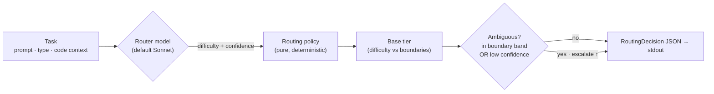

<div align="center">

# 🎯 modelpicker

### Route each task to the right model — *before* you spend a single Fable token.

A cheap **router** model judges how hard a task is; a deterministic policy picks the
model that *should* do the work. Overkill tasks stop landing on your most expensive tier.


**English** · [한국어](README.ko.md)

</div>

---

> [!CAUTION]
> **Archived 2026-06-15 — no longer maintained.** This project was killed by its own
> integration hook; the irony is documented below. The library/CLI still runs as a manual
> tool — the always-on hook that wired it into the real workflow is what burned us.

## ☠️ Post-mortem — how a token-*saver* became a token-*burner*

**The premise.** modelpicker exists to *cut* spend: a cheap router judges a task, then it
runs on the smallest model that can do it. Route *before* you spend a Fable token.

**The main fault — a recursive hook (token fork-bomb).** To wire it into the actual Claude
Code workflow, a `UserPromptSubmit` hook (`hooks/escalation_nudge.py`) called `modelpicker
route` on every substantive prompt. `route` shells out to a judge via `claude -p` (default
`judge_backend: claude_cli`) — and **that subprocess re-loads the project's
`.claude/settings.local.json`, including the very same hook.** The fast-start flags dropped
MCP and tools but never passed `--bare`, so hooks stayed live in the child. So the judge's
own prompt submission re-fired the hook → which ran `route` → which spawned another
`claude -p` → which re-fired the hook → …

A single user prompt did **not** cost *one* extra call (the ≤2× you'd expect). It kicked off
a **recursive chain of cold-boot Claude sessions**, bounded only by the hook's 30s / judge's
25s timeouts and ~3.4s boot latency — roughly **8–9 levels deep** before a timeout cut the
chain. That's why usage didn't merely double; it spiked, then stopped the instant the hook
was removed. A tool built to *cut* spend became a fork-bomb that multiplied it.

**Why it compounded:**
- **The recursion was the root cause.** The judge subprocess inherited the project hooks (no
  `--bare`, no re-entrancy guard), so every judge call birthed another. The two real fixes:
  pass `--bare` to the spawned `claude -p`, *and/or* set an env sentinel the hook checks and
  early-exits on (so a hook can never trigger itself).
- **No prompt cache on the subprocesses.** The main session reads its large context at ~1/10
  cost (cached); every `claude -p` is a cold boot paying full freight for its system prompt.
  So each link in the chain was heavy, not light — recursion × cold-cache, multiplied.
- **The prefilter couldn't stop it.** `TRIVIAL_SKIP` only dodged greetings/typo-fixes; the
  judge's own classifier prompt sailed past it, so every recursion level re-armed.
- **It ran everywhere, silently.** Project-scoped hook → every session paid, with nothing to
  attribute the burn to — *"다른 세션에서도 이상해지는데."*
- **The savings math measured the wrong thing.** "~46% saved" counted the routing *decision*,
  never the *cost of deciding* — and certainly not a recursive stack of deciders.

**Fix / final state.** Hook removed from `.claude/settings.local.json` → the chain can no
longer start. Repo archived. Lessons kept: **(1) a hook that spawns `claude` must run it
`--bare` (or guard against re-entrancy) or it can trigger itself; (2) a router you run
automatically must be cheaper than the decision it saves — a model-call judge on every
prompt is not.**

**Revive it? For this use case, no.** Even with recursion fixed, calling `route` on demand
via MCP isn't meaningfully different from just asking the model inline *"is Sonnet enough for
this?"* — and it can cost **more**: an inline answer reuses the session's cached context (~a
few hundred output tokens), while every `route` is a cold-boot `claude -p` paying full freight
for its system prompt. The router only earns its keep when something *other than a human in a
chat* needs routing: a deterministic / tunable / auditable policy; `run` delegating actual
execution to a cheaper model; or non-interactive callers (scripts, CI, batch). For a solo dev
picking their own model in a chat, that's over-engineering — just ask. Left archived; the code
and 68 tests remain if a system-routing context ever shows up.

---

## The idea

Fable is benchmark-strong but token-hungry — and people reach for it even on work a
smaller model would nail. **modelpicker** puts a cheap triage step in front: a router
model (default **Sonnet**) reads the task, estimates its difficulty, and a transparent
policy decides which tier should run it.

> **Two stages.** **`route`** emits a validated **`RoutingDecision` JSON** — *which* model
> and *why*. **`run`** then executes the task on that model, and **degrades gracefully**
> when a model is unavailable (Fable closed → falls back to Opus → still finishes). So you
> can route *and* run today; Fable execution lights up the moment it's back — no code change.

---

## Two modes

```
 Mode A   opus ── fable                    # $200 / Max plan — Sonnet not needed
 Mode B   sonnet ── opus ── fable          # squeeze cost on easy work too
          └ low ───────── high ┘  (capability & cost)
```

You pick the mode per call with `--mode A|B`.

---

## Does it actually save?

Routing this project's **own build session** — 12 real tasks — through the router:

| → Sonnet (cheap) | → Opus (mid) | → Fable (top) |
|:---:|:---:|:---:|
| **5** | **4** | **3** |

**~46% cost saved** versus running all 12 on Fable — and that's with a third of the work
genuinely Fable-tier. Fable's always-on thinking also burns extra tokens on easy tasks, so
real-world savings run higher. Reproduce: [`examples/savings_demo.py`](examples/savings_demo.py).

---

## How it routes



1. The router model returns a **`difficulty_score`** and **`confidence`** (both 0–1).
2. `difficulty_score` maps to a **base tier** via per-mode boundaries
   (Mode A default `0.5`; Mode B defaults `0.4` / `0.75`).
3. **Performance-first escalation** — if the score sits in a configurable band around a
   boundary, *or* `confidence` is below `confidence_threshold`, the pick bumps up
   `escalation_step` tiers (default 1) and `escalated` is set `true`.

Every knob — `confidence_threshold`, boundaries, band, `escalation_step`, per-model
price rates — is **config-tunable, never hardcoded**.

> **The judgment runs on your Claude subscription by default.** `judge_backend: claude_cli`
> (the default) shells out to the local `claude` CLI — no API key, no separate API billing.
> Set `judge_backend: api` to use the Anthropic SDK with `ANTHROPIC_API_KEY` instead.

---

## Quickstart

```bash
modelpicker route --mode B \
  --prompt "Refactor the auth module across two files" \
  --task-type refactor \
  --context-file ./ctx.json \
  --config ./config.yaml \
  --report-json ./metrics.json
```

**stdout holds only the decision** (metrics go to `--report-json`):

```json
{
  "selected_model": "opus",
  "reasoning": "Moderate two-file refactor; opus is sufficient.",
  "difficulty_score": 0.55,
  "confidence": 0.82,
  "estimated_tokens": 510.25,
  "estimated_cost": 0.012756,
  "escalated": false,
  "alternatives": [
    { "model": "sonnet", "score": 0.65 },
    { "model": "fable",  "score": 0.675 }
  ],
  "latency": 0.41
}
```

A low-confidence task escalates automatically — `sonnet → opus`, `"escalated": true`.

---

## Run it (v2)

`route` only *decides*. `run` decides **and executes** the task on the chosen model —
with graceful fallback if that model is unavailable:

```bash
# Fable closed right now → route picks fable, executor degrades to opus, still finishes
modelpicker run --mode B --prompt "Design a distributed rate limiter" --unavailable fable
```

```
[modelpicker] routed→fable, ran→opus (fell back: fable marked unavailable), 19.8s
<the model's actual answer on stdout>
```

stdout carries the model's answer; the one-line `[modelpicker]` meta goes to stderr. Add
`--json` for a structured `{decision, execution}` object. The fallback chain walks down the
mode's tier order (`fable → opus → sonnet`); mark closed models with `--unavailable` (or
`unavailable_models` in config). Execution uses the same backends as the judge
(`executor_backend: claude_cli` by default — your subscription, no API key).

---

## Use it from Claude Code (MCP)

modelpicker ships an **MCP server** that exposes `route` and `run` as tools, so an MCP
client (Claude Code, Cursor, …) can call it on demand instead of you typing the CLI. This
repo's [`.mcp.json`](.mcp.json) registers it for Claude Code:

```json
{ "mcpServers": { "modelpicker": { "command": "uv", "args": ["run", "--extra", "mcp", "modelpicker-mcp"] } } }
```

Restart the client to load it, then it can call `route` / `run`. It does **not** silently
auto-route your chat — the client invokes the tools explicitly.

---

## Configuration

| Key | Default | Meaning |
|-----|---------|---------|
| `judge_backend` | `claude_cli` | `claude_cli` = local CLI on your subscription (no key) · `api` = Anthropic SDK |
| `router_model` | `sonnet` | model that makes the judgment (`haiku` / `sonnet` / `opus`) |
| `confidence_threshold` | `0.6` | below this → escalate |
| `mode_a_difficulty_boundary` | `0.5` | opus below, fable at/above |
| `mode_b_difficulty_boundaries` | `[0.4, 0.75]` | sonnet \| opus \| fable splits |
| `difficulty_boundary_band` | `0.1` | half-width of the "ambiguous" band |
| `escalation_step` | `1` | tiers to jump on escalation |
| `per_model_price_rates` | `{sonnet:15, opus:25, fable:50}` | $/1M tok for `estimated_cost` |
| `executor_backend` | `claude_cli` | how `run` executes the task (same options as `judge_backend`) |
| `executor_fallback` | `true` | degrade down the tier order when a model is unavailable |
| `unavailable_models` | `[]` | models to skip now, e.g. `["fable"]` while Fable is closed |

See [`examples/config.example.yaml`](examples/config.example.yaml).

---

## Develop

```bash
uv venv && uv pip install -e ".[dev]"
pytest                # 62 tests — models are mocked, so no API key is needed
```

The test suite never calls a live model: golden cases inject a fixed judgment
(`tests/fixtures/golden_cases.yaml`) into the deterministic `route()`. A live
`modelpicker route` call judges via the local `claude` CLI by default — it runs on your
Claude subscription, so **no API key is required**. (Set `judge_backend: api` to use
the Anthropic SDK with `ANTHROPIC_API_KEY` instead.)

---

## Layout

```
src/modelpicker/
├─ models.py    pydantic: RoutingRequest · RoutingDecision · GoldenCase · MetricsReport · enums
├─ config.py    RouterConfig — defaults, ranges, JSON/YAML loading
├─ router.py    core policy: difficulty → tier, band / confidence escalation  (pure, testable)
├─ llm.py       the mockable judgment — local `claude` CLI (subscription) or Anthropic SDK
├─ executor.py  v2 — run the task on the chosen model, with graceful fallback
├─ report.py    MetricsReport builder
└─ cli.py       `modelpicker route …` (decide) · `modelpicker run …` (decide + execute)
tests/
└─ fixtures/golden_cases.yaml   10 deterministic cases, per-mode expectations
```
