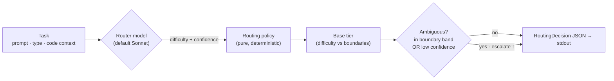

<div align="center">

# 🎯 modelpicker

### Route each task to the right model — *before* you spend a single Fable token.

A cheap **router** model judges how hard a task is; a deterministic policy picks the
model that *should* do the work. Overkill tasks stop landing on your most expensive tier.


**English** · [한국어](README.ko.md)

</div>

---

## The idea

Fable is benchmark-strong but token-hungry — and people reach for it even on work a
smaller model would nail. **modelpicker** puts a cheap triage step in front: a router
model (default **Sonnet**) reads the task, estimates its difficulty, and a transparent
policy decides which tier should run it.

> **v1 is router-only.** It emits a validated **`RoutingDecision` JSON** — *which* model
> and *why*. Actually executing the task on the chosen model is the v2 *executor*
> (the north-star). That separation is on purpose: you can prepare the routing now,
> while Fable is unavailable, and wire execution the moment it's back.

---

## Two modes

```
 Mode A   opus ── fable                    # $200 / Max plan — Sonnet not needed
 Mode B   sonnet ── opus ── fable          # squeeze cost on easy work too
          └ low ───────── high ┘  (capability & cost)
```

You pick the mode per call with `--mode A|B`.

---

## How it routes



1. The router model returns a **`difficulty_score`** and **`confidence`** (both 0–1).
2. `difficulty_score` maps to a **base tier** via per-mode boundaries
   (Mode A default `0.5`; Mode B defaults `0.4` / `0.75`).
3. **Performance-first escalation** — if the score sits in a configurable band around a
   boundary, *or* `confidence` is below `confidence_threshold`, the pick bumps up
   `escalation_step` tiers (default 1) and `escalated` is set `true`.

Every knob — `confidence_threshold`, boundaries, band, `escalation_step`, per-model
price rates — is **config-tunable, never hardcoded**.

> **The judgment runs on your Claude subscription by default.** `judge_backend: claude_cli`
> (the default) shells out to the local `claude` CLI — no API key, no separate API billing.
> Set `judge_backend: api` to use the Anthropic SDK with `ANTHROPIC_API_KEY` instead.

---

## Quickstart

```bash
modelpicker route --mode B \
  --prompt "Refactor the auth module across two files" \
  --task-type refactor \
  --context-file ./ctx.json \
  --config ./config.yaml \
  --report-json ./metrics.json
```

**stdout holds only the decision** (metrics go to `--report-json`):

```json
{
  "selected_model": "opus",
  "reasoning": "Moderate two-file refactor; opus is sufficient.",
  "difficulty_score": 0.55,
  "confidence": 0.82,
  "estimated_tokens": 510.25,
  "estimated_cost": 0.012756,
  "escalated": false,
  "alternatives": [
    { "model": "sonnet", "score": 0.65 },
    { "model": "fable",  "score": 0.675 }
  ],
  "latency": 0.41
}
```

A low-confidence task escalates automatically — `sonnet → opus`, `"escalated": true`.

---

## Configuration

| Key | Default | Meaning |
|-----|---------|---------|
| `judge_backend` | `claude_cli` | `claude_cli` = local CLI on your subscription (no key) · `api` = Anthropic SDK |
| `router_model` | `sonnet` | model that makes the judgment (`haiku` / `sonnet` / `opus`) |
| `confidence_threshold` | `0.6` | below this → escalate |
| `mode_a_difficulty_boundary` | `0.5` | opus below, fable at/above |
| `mode_b_difficulty_boundaries` | `[0.4, 0.75]` | sonnet \| opus \| fable splits |
| `difficulty_boundary_band` | `0.1` | half-width of the "ambiguous" band |
| `escalation_step` | `1` | tiers to jump on escalation |
| `per_model_price_rates` | `{sonnet:15, opus:25, fable:50}` | $/1M tok for `estimated_cost` |

See [`examples/config.example.yaml`](examples/config.example.yaml).

---

## Develop

```bash
uv venv && uv pip install -e ".[dev]"
pytest                # 52 tests — the router model is mocked, so no API key is needed
```

The test suite never calls a live model: golden cases inject a fixed judgment
(`tests/fixtures/golden_cases.yaml`) into the deterministic `route()`. A live
`modelpicker route` call judges via the local `claude` CLI by default — it runs on your
Claude subscription, so **no API key is required**. (Set `judge_backend: api` to use
the Anthropic SDK with `ANTHROPIC_API_KEY` instead.)

---

## Layout

```
src/modelpicker/
├─ models.py    pydantic: RoutingRequest · RoutingDecision · GoldenCase · MetricsReport · enums
├─ config.py    RouterConfig — defaults, ranges, JSON/YAML loading
├─ router.py    core policy: difficulty → tier, band / confidence escalation  (pure, testable)
├─ llm.py       the mockable judgment — local `claude` CLI (subscription) or Anthropic SDK
├─ report.py    MetricsReport builder
└─ cli.py       `modelpicker route …`
tests/
└─ fixtures/golden_cases.yaml   10 deterministic cases, per-mode expectations
```

---

<div align="center">
<sub>Crystallized from an Ouroboros interview → seed <code>seed_522c6edb4617</code> (QA 0.93).</sub>
</div>
